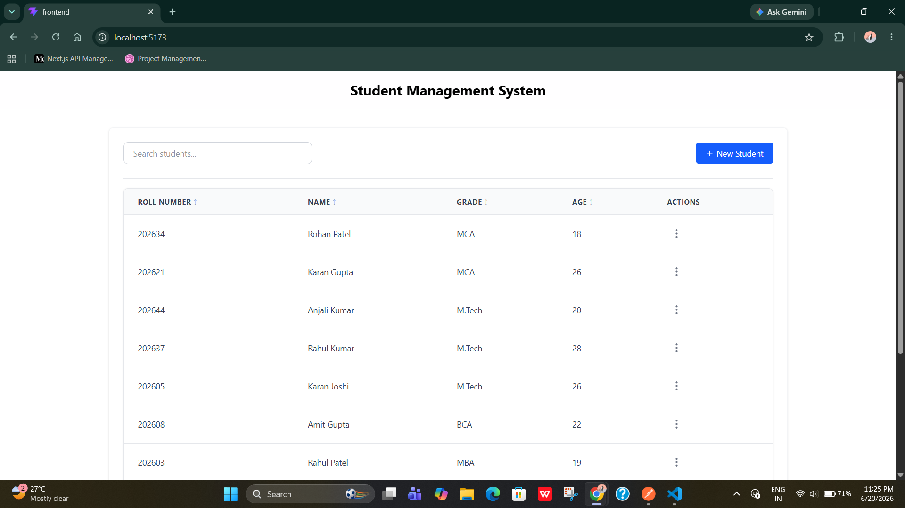
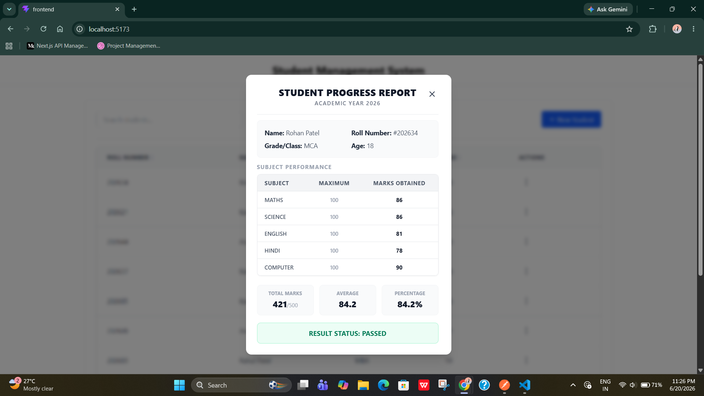
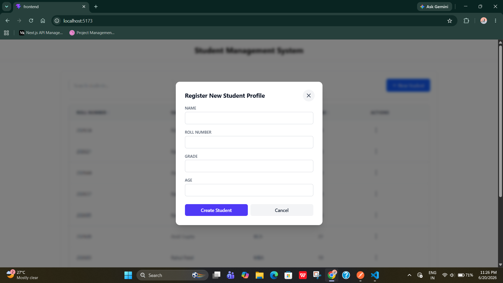
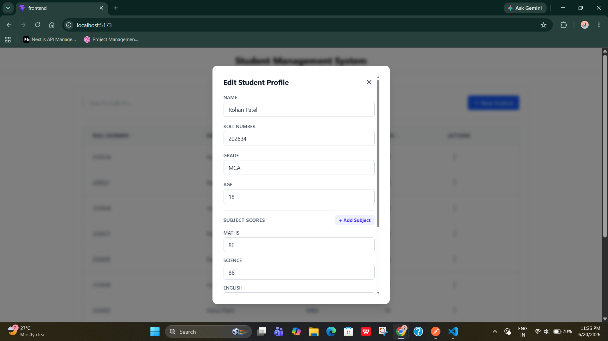
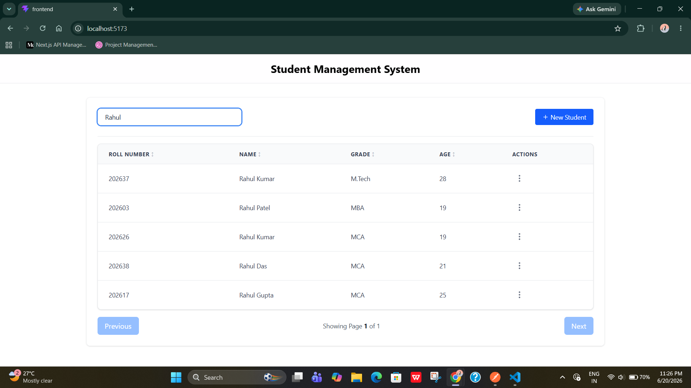

# Student Management System

A Full Stack Student Management System built as part of the Zeerostock Full Stack Developer Assignment.

The application provides student management, marks management, pagination, searching, sorting, and frontend integration using React and Node.js.

---

## Tech Stack

### Backend

* Node.js
* Express.js
* TypeScript
* Prisma ORM
* PostgreSQL
* Zod Validation

### Frontend

* React.js
* TypeScript
* Axios
* Tailwind CSS

### Database

* PostgreSQL

---

## Features

### Student Management

* Create Student
* View All Students
* View Student Details
* Update Student Information
* Delete Student

### Marks Management

* Store subject-wise marks
* Retrieve student marks
* Prevent duplicate subjects for the same student

### Pagination

* Server-side pagination
* Configurable page and limit parameters
* Pagination metadata

### Additional Features

* Search Students
* Sorting
* Form Validation
* Error Handling
* Toast Notifications
* Seed Data Support

---

# Database Schema Design

The database follows normalization principles by separating student information and marks into different tables.

## Students Table

Stores student-related information.

| Column     | Description                |
| ---------- | -------------------------- |
| id         | UUID Primary Key           |
| rollNumber | Unique Student Roll Number |
| name       | Student Name               |
| age        | Student Age                |
| grade      | Student Grade/Class        |
| createdAt  | Record Creation Timestamp  |
| updatedAt  | Record Update Timestamp    |

## Marks Table

Stores marks obtained by students in individual subjects.

| Column    | Description               |
| --------- | ------------------------- |
| id        | UUID Primary Key          |
| studentId | Foreign Key Reference     |
| subject   | Subject Name              |
| score     | Marks Obtained            |
| createdAt | Record Creation Timestamp |

### Relationship

One Student → Many Marks

Example:

Student:

* John Doe

Marks:

* Math → 90
* Science → 85
* English → 95

### Design Decisions

* Student and Marks are stored separately to maintain normalization.
* UUIDs are used as primary keys.
* Roll Number is unique for each student.
* A student can have multiple subjects.
* Duplicate subjects for the same student are prevented using a composite unique constraint.
* Cascade delete ensures marks are automatically removed when a student is deleted.

---

# API Endpoints

## Create Student

POST /api/students

## Get All Students

GET /api/students

### Pagination Example

GET /api/students?page=1&limit=10

## Get Student By ID

GET /api/students/:id

Returns student information along with marks.

## Update Student

PUT /api/students/:id

## Delete Student

DELETE /api/students/:id

---

# Pagination Response

```json
{
  "data": [],
  "pagination": {
    "totalRecords": 50,
    "currentPage": 1,
    "totalPages": 5,
    "limit": 10
  }
}
```

---

# Project Structure

## Backend

```text
backend/
├── prisma
├── src
│   ├── config
│   ├── controllers
│   ├── services
│   ├── routes
│   ├── middleware
│   ├── index.ts
│   ├── seedStudents.ts
```

## Frontend

```text
frontend/
├── src
│   ├── components
│   ├── pages
│   ├── layout
│   ├── api.ts
│   ├── App.tsx
│   └── main.tsx
```

## Shared

```text
shared/
├── schemas.ts
└── types.ts
```

---

# Setup Instructions

## Clone Repository

```bash
git clone <repository-url>
```

## Backend Setup

```bash
cd backend

npm install

cp .env.example .env

npx prisma migrate dev

npm run seed

npm run dev
```

Backend URL:

```text
http://localhost:3000
```

## Frontend Setup

```bash
cd frontend

npm install

npm run dev
```

Frontend URL:

```text
http://localhost:5173
```

---

# Seed Data

Sample student records can be inserted using:

```bash
npm run seed
```

---

## Screenshots

### Student List




### Student Details



### Add Student



### Edit Student



### Search Student



# Assumptions

* Each student has a unique roll number.
* A student can have multiple subjects.
* A student cannot have duplicate entries for the same subject.
* Marks are stored separately for normalization.
* Pagination is implemented at the database level.

---

# Architecture Decisions

* Prisma ORM was chosen for type-safe database access.
* PostgreSQL was used because of its strong relational capabilities.
* Zod was used for request validation.
* Shared types and schemas were used to maintain consistency between frontend and backend.
* Service layer was introduced to separate business logic from controllers.
* Server-side pagination was implemented for scalability and performance.

---

# Future Improvements

* Authentication & Authorization
* Advanced Filtering
* Bulk Import via CSV
* Export to Excel
* Unit Tests
* Integration Tests
* Docker Support
* Role-Based Access Control